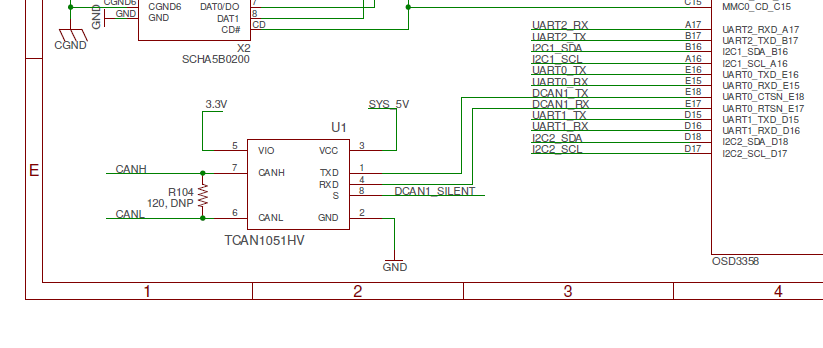

# BeagleBone CAN Bus Configuration

## Hardware setup

Here is an excerpt of the 
[BeagleBone Blue schematic](https://github.com/beagleboard/beaglebone-blue/blob/master/BeagleBone_Blue_sch.pdf), 
which shows the CAN circuitry:



As we can see, the [CAN bus transceiver](https://www.ti.com/product/TCAN1051HV) is 
connected to pins `E18` (TX) and `E17` (RX) of the OSD3358 SiP. There is also another
signal called `DCAN1_SILENT`, which is connected to pin 8 of the CAN transceiver.
This signal goes to pin M16 (`S`") of the OSD3358 SiP. The `S` pin is pulled to 
ground internally. Putting it high actives the "silent mode" of the 
transceiver, which prevents communication from the `TXD` pin to the CAN bus.
The receiver remains active; communication from the CAN bus still gets passed
to the `RXD` output pin.

## Pin configuration and device tree overlays
Some of my previous attempts at making this work were hampered by the fact that
the BeagleBone hardware doesn't seem to be particularly well documented, and the 
pin assignments for the CAN bus pins weren't implemented correctly. Luckily,
as of the Linux kernel 4.16 and on, this problem has been fixed, so that the
pins of the CAN bus connector on the BeagleBone Blue are correctly assigned.
For reference, the device tree for the BeagleBone Blue used in the build that
I am using is [this one](https://github.com/torvalds/linux/blob/v4.19/arch/arm/boot/dts/am335x-boneblue.dts) 
(the latest version is [here](https://github.com/torvalds/linux/blob/master/arch/arm/boot/dts/am335x-boneblue.dts)).


* (https://www.marklin-users.net/forum/posts/t36089-Computer-interface-for-Marklin-Track-Box-and-mfx-programming)
* Yellow is CAN-L, connected with Red on BBB
* BL-GN is CAN-H, connected with Black on BBB
* Connector is 4-wire JST-SH (1mm pitch) 


## CAN network configuration

```
sudo ip link set can0 up type can bitrate 250000
```

https://developer.ridgerun.com/wiki/index.php/How_to_configure_and_use_CAN_bus
https://electronics.stackexchange.com/questions/195416/beaglebone-black-can-bus-setup
https://www.thomas-wedemeyer.de/beaglebone-canbus-python.html


## CAN testing

